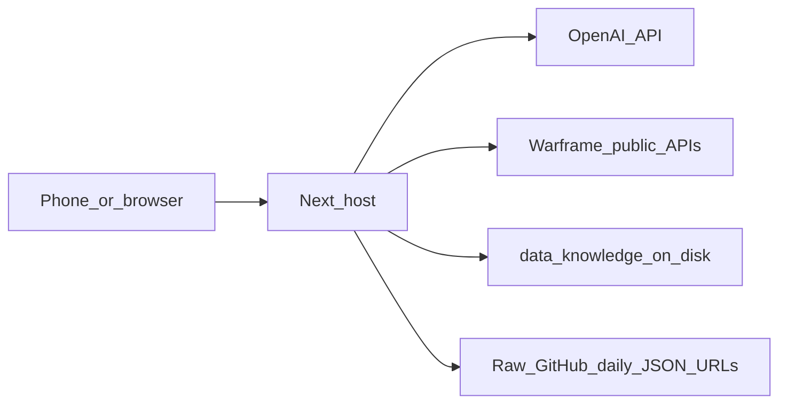

# Hosting the web chat (OpenAI + public URL)

Personal deploy guide for the Next.js web chat in [`web/`](../web/). The app is **not** a static site: it needs a **Node.js** host for `/api/chat` (up to **120s**), `/api/auth`, and `/api/health`. LLM calls are **server-side**.



Canonical local env template: [`web/.env.example`](../web/.env.example). Product behavior stays in [`web-chat.md`](web-chat.md).

## Ranked picks

| Priority | Host | Best when |
| --- | --- | --- |
| 1 | **Vercel** | Fastest path; OpenAI + live Warframe APIs; least ops |
| 2 | **Fly.io / Railway** | Whole monorepo + `data/knowledge` on disk; long timeouts |
| 3 | **VPS** | Full control; optional co-hosted Ollama later |

### Do not use as primary host

- **Static CDN / GitHub Pages alone** — no Node API or pack filesystem
- **Client-only OpenAI keys in the browser** — keys still relay through `/api/chat`; keep the real key in server env and set **`CHAT_PASSWORD`**

## Launch checklist (any host)

1. Set `OPENAI_API_KEY` + `OPENAI_MODEL` (e.g. `gpt-4o-mini`). Add `OPENAI_VISION_MODEL` (e.g. `gpt-4o`) if you attach loadout screenshots.
2. Set **`CHAT_PASSWORD` on day one** so strangers cannot burn credits.
3. If you care about `/market-changes` / `/patch-changes` in prod, set `MARKET_CHANGES_URL`, `PATCH_CHANGES_URL`, and optional `PATCH_SNAPSHOT_URL` to raw GitHub URLs under `data/`.
4. Confirm outbound HTTPS to: your model provider, `api.warframestat.us`, `api.warframe.market`, `warframe.com`.
5. Smoke-test: `/api/health` → `/cycles` (or another slash) → one plain-language OpenAI turn.
6. Treat **OpenAI as the billable line item**; Warframe public APIs are free. Cost scales with tool rounds + vision.

There is **no app-level rate limit** — the password gate is the main spend control.

---

## 1. Vercel (default)

Fastest path from `npm run web:dev` to a phone-friendly URL. [`web/vercel.json`](../web/vercel.json) sets the Next.js framework and a **120s** function limit for chat.

### Setup

1. Import the GitHub repo in Vercel.
2. Set **Root Directory** to `web`.
3. Add environment variables (Production + Preview as needed):

| Variable | Required | Example / notes |
| --- | --- | --- |
| `OPENAI_API_KEY` | yes (model mode) | Server-side only |
| `OPENAI_MODEL` | no | `gpt-4o-mini` |
| `OPENAI_VISION_MODEL` | no | `gpt-4o` for screenshots |
| `CHAT_PASSWORD` | strongly recommended | Shared password cookie |
| `MARKET_CHANGES_URL` | for daily market diffs | Raw `data/market/latest-changes.json` |
| `PATCH_CHANGES_URL` | for daily patch diffs | Raw `data/patches/latest-changes.json` |
| `PATCH_SNAPSHOT_URL` | optional | Raw `data/patches/latest-snapshot.json` |

4. Deploy.

### Watchouts

- Chat tool loops may run up to **120s** — Hobby plans can be shorter; use a plan that allows the duration.
- Offline pack resolves via `cwd` or `../data/knowledge` ([`web/src/lib/local-knowledge.ts`](../web/src/lib/local-knowledge.ts)). With root `web/`, `../data/knowledge` works only when that pack is present in the **full repo checkout** Vercel builds from (it is, for this monorepo).
- Live market/patch hub tools work without the `*_CHANGES_URL` vars; day-over-day scrape diffs need those URLs.

---

## 2. Fly.io (feels like local)

Deploy the **whole monorepo** so `data/knowledge` stays on disk. Config: repo-root [`Dockerfile`](../Dockerfile) + [`fly.toml`](../fly.toml).

### One-time

```bash
# From repo root (install flyctl first: https://fly.io/docs/hands-on/install-flyctl/)
fly auth login
fly apps create warframe-build-agent   # pick a unique name; update fly.toml app = "..."
fly secrets set OPENAI_API_KEY=sk-... OPENAI_MODEL=gpt-4o-mini CHAT_PASSWORD=changeme
# Optional:
# fly secrets set OPENAI_VISION_MODEL=gpt-4o
# fly secrets set MARKET_CHANGES_URL=https://raw.githubusercontent.com/<you>/Warframe-Build-Agent/main/data/market/latest-changes.json
# fly secrets set PATCH_CHANGES_URL=https://raw.githubusercontent.com/<you>/Warframe-Build-Agent/main/data/patches/latest-changes.json
```

### Deploy

```bash
fly deploy
```

App listens on **port 3000**. Health check: `/api/health`.

### Notes

- Image includes `web/` + `data/knowledge` (and daily JSON under `data/` when present in the build context).
- Long request times are fine on a Fly machine; size the VM if vision + tool loops feel slow.
- Same env semantics as Vercel / `.env.example`.

### Railway (same idea)

Create a Node 20 service from the GitHub repo, set the start command to the web production server, and inject the same secrets:

```bash
npm --prefix web ci
npm --prefix web run build
npm --prefix web run start
```

Or build with the root `Dockerfile` if the platform supports Dockerfiles. Ensure the working directory / checkout includes `data/knowledge` next to `web/`.

---

## 3. VPS (max control)

Closest to local `npm run web:dev` / `web:start`. Good if you may later point `OPENAI_BASE_URL` at Ollama on the same box.

### Setup sketch

1. Provision Ubuntu (or similar) on Hetzner / DigitalOcean / etc.
2. Install **Node.js 20+**.
3. Clone the repo and install:

```bash
git clone https://github.com/henrywguan/Warframe-Build-Agent.git
cd Warframe-Build-Agent
npm --prefix web ci
npm --prefix web run build
```

4. Create `web/.env.local` (or systemd `Environment=`) with `OPENAI_API_KEY`, `OPENAI_MODEL`, `CHAT_PASSWORD`, and optional daily URLs / vision model.
5. Run `npm --prefix web run start` (binds `localhost:3000` by default) or `npm --prefix web run start:lan` for all interfaces.
6. Put **Caddy** or **nginx** in front for HTTPS and reverse-proxy to port 3000.
7. Optional systemd unit to keep the process up after reboot.

You can also run the root `Dockerfile` with Docker/Podman on the VPS if you prefer containers.

---

## Env reference (server)

| Variable | Purpose |
| --- | --- |
| `OPENAI_API_KEY` | Cloud or local OpenAI-compatible key |
| `OPENAI_MODEL` | Default chat model |
| `OPENAI_VISION_MODEL` | Screenshot / vision model |
| `OPENAI_BASE_URL` | Ollama / LM Studio / proxy (usually local/VPS only) |
| `CHAT_MODE` | `local` / `offline` = no LLM |
| `CHAT_PASSWORD` | Shared password gate |
| `MARKET_CHANGES_URL` | Daily market scrape JSON |
| `PATCH_CHANGES_URL` | Daily patch scrape JSON |
| `PATCH_SNAPSHOT_URL` | Patch snapshot fallback |
| `ALLOW_LOCAL_DAILY_DATA` | Set `true` only if the host should read local `data/market|patches` in production |

## Security

- Keep `OPENAI_API_KEY` in host secrets / env — never ship it in client bundles.
- Always set `CHAT_PASSWORD` for a public URL.
- This is a lightweight personal relay, not multi-user auth.
